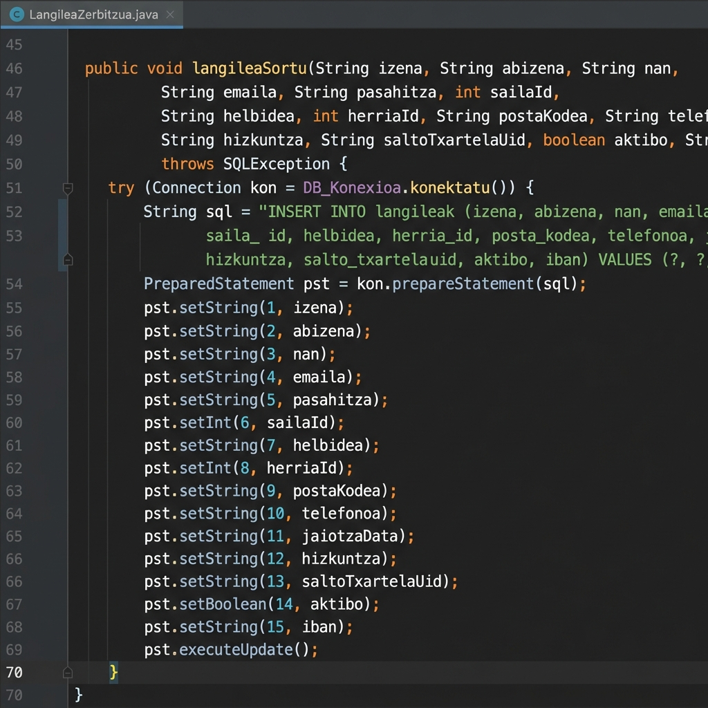

# Klase eta Metodoen Kode Adibideak

Dokumentu honek proiektuan erabili diren klase eta metodo nagusien kode adibideak biltzen ditu, inplementazioaren xehetasunak erakusteko helburuarekin.

## 1. Datu-base Konexioa

### `db.DB_Konexioa`

Datu-basera konektatzeko Singleton patroia erabiltzen duen klasea.

```java
public static Connection konektatu() {
    try {
        if (instance == null || instance.isClosed()) {
            // Driver-a kargatu (aukerakoa JDBC 4.0+ bertsioetan, baina gomendagarria)
            Class.forName("com.mysql.cj.jdbc.Driver");
            instance = DriverManager.getConnection(URLEA, ERABILTZAILEA, PASAHITZA);
        }
    } catch (ClassNotFoundException e) {
        System.err.println("MySQL Driver-a ez da aurkitu: " + e.getMessage());
    } catch (SQLException e) {
        System.err.println("Errorea datu-basera konektatzean: " + e.getMessage());
    }
    return instance;
}
```

## 2. Eredua (Model)

### `model.Langilea`

Langileen kudeaketarako oinarrizko klasea. Hemen fitxaketa eta datuen edizioa kudeatzen dira.

**Fitxaketa Logika:**

```java
public void fitxatu(String fitxaketa_mota) throws java.sql.SQLException {
    String galdera = "SELECT mota FROM fitxaketak WHERE langilea_id = ? ORDER BY id_fitxaketa DESC LIMIT 1";
    try (java.sql.Connection konexioa = DB_Konexioa.konektatu()) {
        boolean barruan = false;
        // ... (Egiaztapenak) ...

        // Balidazioak barruan aldagaia erabiliz
        if ("Sarrera".equals(fitxaketa_mota) && barruan) {
            throw new java.sql.SQLException("Jada barruan zaude.");
        }
        if ("Irteera".equals(fitxaketa_mota) && !barruan) {
            throw new java.sql.SQLException("Jada kanpoan zaude. Ezin duzu irten sartu gabe.");
        }

        // INSERT egin fitxaketak taulan: 
        String insertKontsulta = "INSERT INTO fitxaketak (langilea_id, mota, data, ordua) VALUES (?, ?, CURRENT_DATE, CURRENT_TIME)";
        try (java.sql.PreparedStatement pstInsert = konexioa.prepareStatement(insertKontsulta)) {
            pstInsert.setInt(1, this.getIdLangilea());
            pstInsert.setString(2, fitxaketa_mota);
            pstInsert.executeUpdate();
        }
    }
}
```

**Datuak Editatu:**

```java
public void nireLangileDatuakEditatu(String pasahitza, String hizkuntza, int herriaId, String telefonoa, String helbidea) throws java.sql.SQLException {
    String sql = "UPDATE langileak SET pasahitza = ?, hizkuntza = ?, herria_id = ?, telefonoa = ?, helbidea = ?, eguneratze_data = NOW() WHERE id_langilea = ?";
    try (java.sql.Connection konexioa = DB_Konexioa.konektatu();
            java.sql.PreparedStatement sententzia = konexioa.prepareStatement(sql)) {
        sententzia.setString(1, pasahitza);
        sententzia.setString(2, hizkuntza);
        sententzia.setInt(3, herriaId);
        sententzia.setString(4, telefonoa);
        sententzia.setString(5, helbidea);
        sententzia.setInt(6, this.getIdLangilea());
        sententzia.executeUpdate();

        // Objektuaren datuak eguneratu
        this.setPasahitza(pasahitza);
        this.setHizkuntza(hizkuntza);
        this.setHerriaId(herriaId);
        this.setTelefonoa(telefonoa);
        this.setHelbidea(helbidea);
    }
}
```

### `model.SalmentaLangilea`

Salmenta espezifikoak diren funtzioak (adb. faktura sortu).

```java
// Faktura PDF sortzeko metodo nagusia
public void fakturaSortu(int idEskaera) throws Exception {
    // ... Datuak lortu eta PDF sortu ...
    FakturaPDF.sortu(fakturaZenbakia, data, bezeroDatuak, lerroak, guztira, fitxategia.getAbsolutePath());
    // ... DBan erregistratu ...
}
```

### `model.AdministrariLangilea`

Administrazio funtzioak, hala nola langile berriak sortzea.

**Langilea Sortu:**



## 3. Interfazea (UI)

### `ui.MenuSalmentak`

Salmenta menu nagusiaren logika.

**Eskaera Sortu:**

```java
private void eskaeraGehitu() {
    EskaeraDialog dialog = new EskaeraDialog(this, "Gehitu Eskaera", null, "Prestatzen");
    dialog.setVisible(true);
    if (dialog.isOnartua()) {
        String sqlEskaera = "INSERT INTO eskaerak (bezeroa_id, langilea_id, data, eguneratze_data, guztira_prezioa, eskaera_egoera) VALUES (?, ?, NOW(), NOW(), ?, ?)";

        try (Connection konexioa = DB_Konexioa.konektatu()) {
            konexioa.setAutoCommit(false); // Transakzioa hasi
            // ... (Eskaera eta lerroak txertatu) ...
            konexioa.commit(); // Transakzioa baieztatu
            datuakKargatu();
        } catch (SQLException e) {
            e.printStackTrace();
        }
    }
}
```

### `ui.NireDatuakDialog`

Erabiltzailearen datuak editatzeko elkarrizketa-koadro pertsonalizatua (`JDialog`).

```java
private void gordeDatuak() {
    String pass = new String(pasahitzaField.getPassword());
    String hizkuntza = (String) hizkuntzaBox.getSelectedItem();
    Herria aukeratua = (Herria) herriaBox.getSelectedItem();
    String tlf = telefonoaField.getText().trim();
    String helbidea = helbideaField.getText().trim();

    if (pass.isEmpty()) {
        JOptionPane.showMessageDialog(this, "Pasahitza ezin da hutsik egon.");
        return;
    }

    try {
        langilea.nireLangileDatuakEditatu(pass, hizkuntza, aukeratua.getIdHerria(), tlf, helbidea);
        JOptionPane.showMessageDialog(this, "Datuak ondo eguneratu dira.");
        dispose();
    } catch (SQLException e) {
        e.printStackTrace();
        JOptionPane.showMessageDialog(this, "Errorea gordetzean: " + e.getMessage());
    }
}
```
