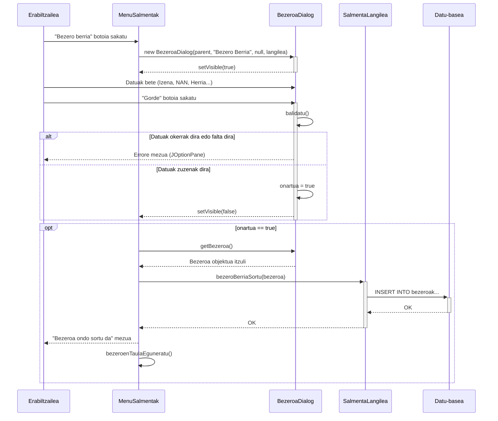

# Sekuentzia Diagrama: Bezero Berria Sortu

```mermaid
sequenceDiagram
    participant User as Erabiltzailea
    participant View as MenuSalmentak
    participant Dialog as BezeroaDialog
    participant Controller as SalmentaLangilea
    participant DB as Datu-basea

    User->>View: "Bezero berria" botoia sakatu
    View->>+Dialog: new BezeroaDialog(parent, "Bezero Berria", null, langilea)
    Dialog-->>-View: setVisible(true)
    
    User->>Dialog: Datuak bete (Izena, NAN, Herria...)
    User->>Dialog: "Gorde" botoia sakatu
    
    activate Dialog
    Dialog->>Dialog: balidatu()
    
    alt Datuak okerrak dira edo falta dira
        Dialog-->>User: Errore mezua (JOptionPane)
    else Datuak zuzenak dira
        Dialog->>Dialog: onartua = true
        Dialog-->>View: setVisible(false)
    end
    deactivate Dialog
    
    opt onartua == true
        View->>Dialog: getBezeroa()
        Dialog-->>View: Bezeroa objektua itzuli
        
        View->>+Controller: bezeroBerriaSortu(bezeroa)
        Controller->>+DB: INSERT INTO bezeroak...
        DB-->>-Controller: OK
        Controller-->>-View: OK
        
        View-->>User: "Bezeroa ondo sortu da" mezua
        View->>View: bezeroenTaulaEguneratu()
    end
```
