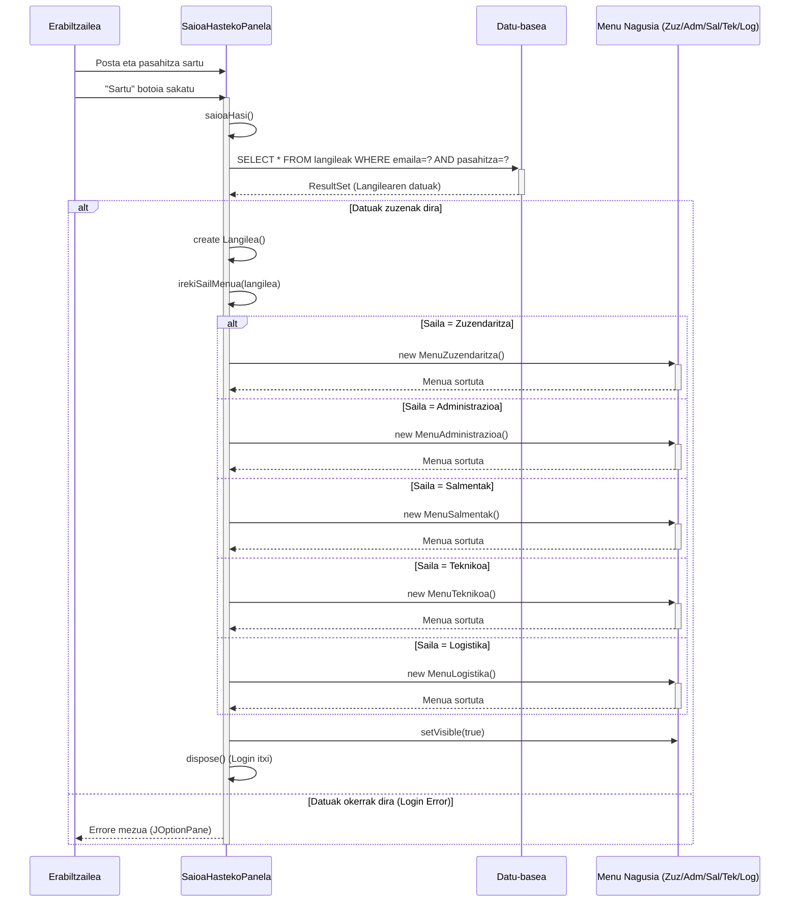

# Sekuentzia Diagrama: Login Prozesua

```mermaid
sequenceDiagram
    participant User as Erabiltzailea
    participant Login as SaioaHastekoPanela
    participant DB as Datu-basea
    participant Menu as Menu Nagusia (Zuz/Adm/Sal/Tek/Log)

    User->>Login: Posta eta pasahitza sartu
    User->>Login: "Sartu" botoia sakatu
    
    activate Login
    Login->>Login: saioaHasi()
    
    Login->>+DB: SELECT * FROM langileak WHERE emaila=? AND pasahitza=?
    DB-->>-Login: ResultSet (Langilearen datuak)
    
    alt Datuak zuzenak dira
        Login->>Login: create Langilea()
        Login->>Login: irekiSailMenua(langilea)
        
        alt Saila = Zuzendaritza
            Login->>+Menu: new MenuZuzendaritza()
            Menu-->>-Login: Menua sortuta
        else Saila = Administrazioa
            Login->>+Menu: new MenuAdministrazioa()
            Menu-->>-Login: Menua sortuta
        else Saila = Salmentak
            Login->>+Menu: new MenuSalmentak()
            Menu-->>-Login: Menua sortuta
        else Saila = Teknikoa
            Login->>+Menu: new MenuTeknikoa()
            Menu-->>-Login: Menua sortuta
        else Saila = Logistika
            Login->>+Menu: new MenuLogistika()
            Menu-->>-Login: Menua sortuta
        end
        
        Login->>Menu: setVisible(true)
        Login->>Login: dispose() (Login itxi)
        
    else Datuak okerrak dira (Login Error)
        Login-->>User: Errore mezua (JOptionPane)
    end
    deactivate Login
```
